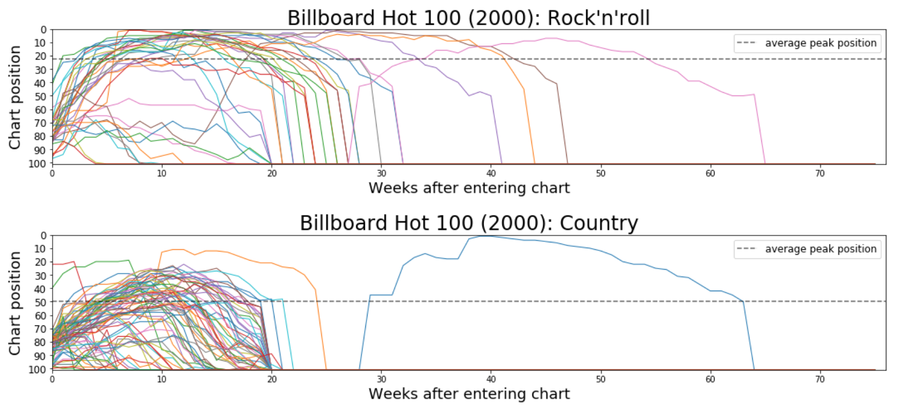

# BillboardHot100
EDA and hypothesis testing on Billboard Hot 100 weekly lists from the year 2000.

&nbsp;&nbsp;&nbsp;&nbsp;&nbsp;This is an older project I revisited to update the code of my former self and to see if I could get any more interesting plots out of it.  Data set was given to us in class; I think it was doctored a little to include nulls/etc.  Chart position over time curves by track are multicolor because it was difficult to distinguish a single curve's path with so many intersections.  Hypothesis test shows significant difference (alpha = 0.05) in mean peak position attained by country tracks vs rock'n'roll tracks.  

Enjoy.
